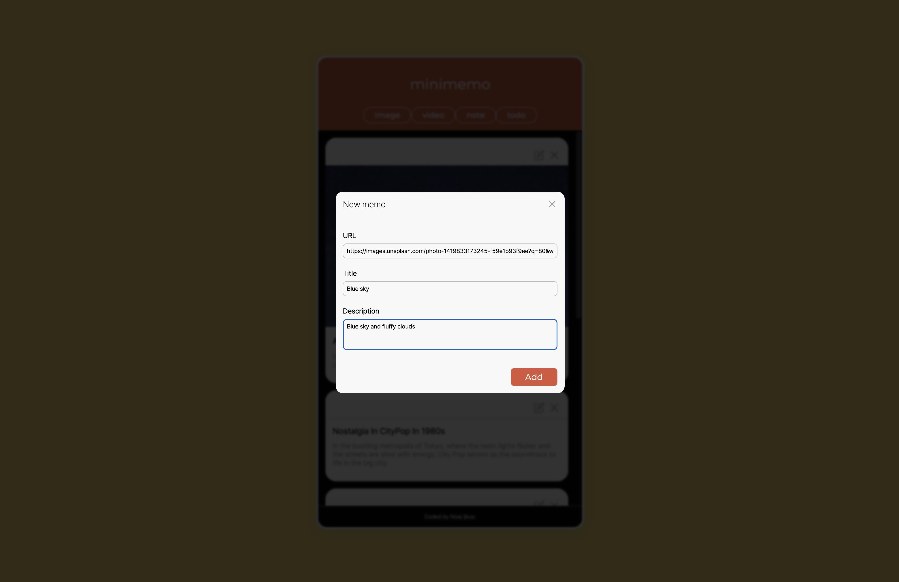

# MiniMemo App - WIP

A memo application project with HTML, CSS, and TypeScript.

You can see more details on the **[PROCESS_NOTE.md](https://github.com/ijkuS/miniMemo-1/blob/master/PROCESS_NOTE.md)**
which aims to document the development process of the MiniMemo app.

## Table of contents

-    [Overview](#overview)

     -    [Goal](#goal)
     -    [Links](#links)

-    [My process](#my-process)

     -    [Planning](#planning)
          -    [Basic interaction planning](#basic-interaction-planning)
          -    [Technical planning](#technical-planning)

-    [Challenges and Lessons](#challenges-and-lessons)

     -    [1. TypeScript environment Preparation](#1-typescript-environment-preparation)
     -    [2. Component planning for OOP](#2-component-planning-for-oop)
     -    [3. File organization](#3-file-organization)
     -    [4. Use RegExp to extract videoId from URL](#4-use-regexp-to-extract-videoid-from-url)
     -    [5. Purpose of creating PageItemComponent](#5-purpose-of-creating-pageitemcomponent)
     -    [6. Role of interface 'Composable' and 'Component'](#6-role-of-interface-composable-and-component)
     -    [7. Role of closeListener](#7-role-of-closelistener)
     -    [8. Difference between 'onclick' and 'addEventListener'](#8-difference-between-onclick-and-addeventlistener)
     -    [9. Refactoring: Dependency Injection](#9-refactoring-dependency-injection)
     -    [10. Refactoring: Dialog](#10-refactoring-dialog)
     -    [11. Edit memo items](#11-edit-memo-item)

     -    WIP [Troubleshooting: Youtube X-Frame-Options to sameorigin](#troubleshooting-youtube-x-frame-options-to-sameorigin)
     -    [Troubleshooting: Edit a video item](#troubleshooting-edit-a-video-item)

     -    [Unique ID](#unique-id)
     -    [[CSS Tips] border-radius and `overflow: hidden`](#css-tips-border-radius-and-overflow-hidden)
     -    [[CSS Tips] Scroll bar styling](#css-tips-scroll-bar-styling)

-    [Future Improvements](#future-improvements)
-    [Useful resources](#useful-resources)
-    [Author](#author)
-    [Acknowledgments](#acknowledgments)

## Overview

-    This project serves as an exercise to deepen familiarity with TypeScript and object-oriented programming (OOP).
-    A React-like component-based file structure was adopted for better maintainability, though the React library itself was not used.
-    The project is designed as a web application.

### Screenshot

#### minimemo screenshot - App Main


#### minimemo screenshot - App Dialog for adding a memo 



### Goal

Users should be able to:

**Must have**

-    [x] See all memos on the homepage
-    [x] Add a memo with an image, a video, a note, a todo on the homepage
-    [x] Delete each memo

**Good to have**

-    [x] Edit all the memo
-    [ ] Filter memos by group (image / video / todo / note)
-    [ ] Reorder memos with drag & drop motion

**Optional**

-    [ ] Search for a keyword
-    [ ] Toggle the color scheme between light and dark mode

### Links

-    gitHub URL:
-    Live Site URL: [Add live site URL here](https://your-live-site-url.com)

## My process

### Planning

#### App UX/UI Planning - SPA

```
-    header / navbar
     -    Logo
     -    Buttons
     -    Image button (to add new Image memo)
     -    Video button (to add new Video memo)
     -    Note button (to add new Note memo)
     -    Todo button (to add new Todo memo)
     -    (Optional) Toggle button for dark mode and light mode
     -    (Optional) Search input
     -    (Optional) Login/Logout

-    main
     -    list of memos
-    footer
     -    license information
```

#### Basic interaction planning

```
-    Click Image & Video button (media-section)
      → popup input window (dialog)
      → input: title / url
      → add button click
      → update the main list on the board
```

```
-    Click Note & Todo button (text-section)
      → popup input window (dialog)
      → input: title / description(body)
      → add button click
      → update the main list on the board
```

```
-    The composition of the list of memos

           - a memo box of media-section
                -    'delete' button
                -    Title
                -    Thumbnail of image or iframe of video

           -  a memo box of text-section
                -    'delete' button
                -    Title
                -    Body (description)
```

#### Technical planning

-    Semantic HTML5 markup
-    CSS custom properties
-    Mobile-first workflow
-    [TypeScript](https://www.typescriptlang.org/)

#### Part 1: Must have features

-    See all memos on the homepage
     -    `app.ts`: main page
-    Add a memo with an image, a video, a note, a todo on the homepage
     -    Use Dialog
-    Delete each memo
     -    Delete the last child element itself

#### Part 2: Good to have features

-    Edit each memo list item
     -    make Edit button
     -    require list id -> find the list id and edit

## Challenges and Lessons

### 1. TypeScript environment Preparation

-    tsc watch mode and init for making tsconfig.json
-    Set up tsconfig.json

`index.html` : the below information needed to work with multiple TS files

```html
<script type="module" src="./build/app.js" defer></script>
```

### 2. Component planning for OOP

Before starting the project, I tried to plan the basic tree of the components for its relations.

**Set up the project structure with essential files**

-    `app.ts` : app main display
     -    class App
-    `page.ts` : ul
     `class PageComponent`
-    `image.ts` : image list item section
     -    `class ImageComponent`

> Since PageComponent and ImageComponent are quite similar, I can make class BaseComponent that 2 components can extend(inherit)

-    `component.ts` :
     -    `class BaseComponent` & `interface Component`

> **interface Component** with BaseComponent.
>
> -    Reusability
> -    No more repeated 'template' creation and calling 'attachTo()'

Updated `page.ts`

```typescript
import { BaseComponent } from '../component.js';

export class PageComponent extends BaseComponent<HTMLUListElement> {
	constructor() {
		super(`<ul class="page">This is PageComponent</ul>`);
	}
}
```

### 3. File organization

Even this project is not large project, I tried to organize folders and files to understand well.

example of file tree at planning stage

```
// Initial file Tree
src
 ┣ components
 ┃ ┣ pages
 ┃ ┃ ┣ item
 ┃ ┃ ┃ ┣ image.ts
 ┃ ┃ ┃ ┣ note.ts
 ┃ ┃ ┃ ┣ todo.ts
 ┃ ┃ ┃ ┗ video.ts
 ┃ ┃ ┗ page.ts
 ┃ ┗ component.ts
 ┗ app.ts
```

```
// File tree before adding Edit feature

src
 ┣ components
 ┃ ┣ dialog
 ┃ ┃ ┣ input
 ┃ ┃ ┃ ┣ media-input.ts
 ┃ ┃ ┃ ┗ text-input.ts
 ┃ ┃ ┗ dialog.ts
 ┃ ┣ pages
 ┃ ┃ ┣ item
 ┃ ┃ ┃ ┣ image.ts
 ┃ ┃ ┃ ┣ note.ts
 ┃ ┃ ┃ ┣ todo.ts
 ┃ ┃ ┃ ┗ video.ts
 ┃ ┃ ┗ page.ts
 ┃ ┗ component.ts
 ┗ app.ts
```

### 4. Use RegExp to extract videoId from URL

The following are several possible formats for YouTube URL attachments:

```
1.    https://www.youtube.com/watch?v=videoId
2.    https://youtu.be/videoId
3.    https://www.youtube.com/embed/videoId
```

**Solution:**
By utilizing [Regular Expression](https://regexr.com/), the `videoId` can be extracted from the URL provided by users. Using the extracted `videoId`, a new URL is generated to embed the video.

-    1st option

```typescript
const regExp = /(?:youtu\.be\/|youtube\.com\/.*[?&]v=)([a-zA-Z0-9_-]{11})/;
```

-    2nd option

```typescript
const regExp =
	/^(?:https?:\/\/)?(?:www\.)?(?:(?:youtube.com\/(?:(?:watch\?v=)|(?:embed\/))([a-zA-Z0-9-]{11}))|(?:youtu.be\/([a-zA-Z0-9-]{11})))/;
```

### 5. Purpose of creating 'PageItemComponent'

The purpose of creating PageItemComponent is to separate the content components (such as Note, Image, Video, or Todo) from additional functionality like the close button. This approach allows for better control over features without directly embedding them within the content itself.

Had the close button been added directly to each component, managing different display modes—such as a preview mode where the close button is unnecessary—would have required additional, repetitive logic within each component. This could lead to increased complexity and reduced maintainability.

By using PageItemComponent to encapsulate the content, shared features like the close button are implemented once, ensuring a cleaner, more maintainable codebase. This structure also enhances flexibility, making it easier to adapt to future requirements or extend functionality.

(a list item structure by using PageItemComponent)

```html
<li class="page-item">
	<div class="page-item__controls">
		<button class="close">×</button>
	</div>
	<section class="page-item__body">
		<section class="image">
			<div class="image__holder">
				
			</div>
			<h2 class="image__title">Image Title</h2>
			<p class="image__description">Image Description</p>
		</section>
	</section>
</li>
```

### 6. Role of interface 'Composable' and 'Component'

Interfaces in TypeScript help reduce dependencies between classes, making your code more flexible and easier to maintain. Instead of classes directly knowing and depending on each other, they communicate through interfaces.

When classes are tightly connected, changing one class can force you to update many other parts of your code. By using interfaces, you define a set of rules that multiple classes can follow. This way, you can swap out one class for another without changing everything that relies on it.

In short, interfaces make your code more flexible, allowing you to easily update or extend it without breaking everything else.

### 7. Role of closeListener

-    **The Role of closeListener**
     The closeListener in PageItemComponent is designed to handle the event when the close button is clicked.

     It serves as a variable that holds a callback function, which is executed upon the button's press.
     This separation of concerns allows for better flexibility, as the PageItemComponent can delegate specific actions—such as removing itself—to external logic, rather than managing it internally.

-    **What happens without closeListener?**  
     Without the closeListener, you would need to embed the logic for removing the item directly
     within PageItemComponent. However, this approach tightly couples the component
     with the behavior of removing itself, which reduces the overall flexibility and reusability of the structure.

**Solution:**

-    Create `closeListener` `type OnCloseListener` `setOnCloseListener()`
-    Create `removeFrom(parent)` at interface Component: an API that removes itself from parent

### 8. Difference between 'onclick' and 'addEventListener'

### 9. Refactoring: Dependency Injection

**Decoupling Classes**

-    Issue: Inside PageComponent, the PageItemComponent was being created directly.
     There was no use of dependency injection (DI), leading to excessive coupling between the classes.
-    **Solution:** Create an interface, SectionContainer, to represent and define the key specifications of PageItemComponent.
     Instead of directly using PageItemComponent in PageComponent, use the SectionContainer interface type.
     Now, PageComponent can work with any class that follows the SectionContainer interface, making it a more flexible and adaptable component.

### 10. Refactoring: Dialog

-    Issue: The current code has a strong coupling with MediaSectionInput and TextSectionInput, which reduces scalability.

-    **Solution:** Create an interface to facilitate communication within `dialog.ts`

```
// 'app.ts' snippet has coupling issue

type InputComponentConstructor<T extends MediaSectionInput | TextSectionInput> =
	{
		new (): T;
	};
class App {
	// private readonly page: PageComponent;
	private readonly page: Component & Composable;
	constructor(appRoot: HTMLElement, private dialogRoot: HTMLElement) {
		this.page = new PageComponent(PageItemComponent);
		this.page.attachTo(appRoot);

		this.bindElementToDialog<MediaSectionInput>(
			'#new-image',
			MediaSectionInput,
			(input: MediaSectionInput) =>
				new ImageComponent(input.title, input.body, input.url)
		);
		this.bindElementToDialog<MediaSectionInput>(
			'#new-video',
			MediaSectionInput,
			(input: MediaSectionInput) =>
				new VideoComponent(input.title, input.body, input.url)
		);
		this.bindElementToDialog<TextSectionInput>(
			'#new-note',
			TextSectionInput,
			(input: TextSectionInput) =>
				new NoteComponent(input.title, input.body)
		);
		this.bindElementToDialog<TextSectionInput>(
			'#new-todo',
			TextSectionInput,
			(input: TextSectionInput) =>
				new TodoComponent(input.title, input.body)
		);
	}
	private bindElementToDialog<
		T extends MediaSectionInput | TextSectionInput
	>(
		selector: string,
		InputComponent: InputComponentConstructor<T>,
		createComponent: (input: T) => Component
	) {
		const button = document.querySelector(selector)! as HTMLButtonElement;
		button.addEventListener('click', () => {
			const dialog = new InputDialog();
			const inputSection = new InputComponent();
			dialog.addChild(inputSection);

			dialog.setOnCloseListener(() => {
				dialog.removeFrom(this.dialogRoot);
			});
			dialog.setOnSubmitListener(() => {
				const createdComponent = createComponent(inputSection);
				this.page.addChild(createdComponent);
				dialog.removeFrom(this.dialogRoot);
			});
			dialog.attachTo(this.dialogRoot);
		});
	}
}

new App(document.querySelector('.document')! as HTMLElement, document.body);
```

```
// 'app.ts' snippet after refactoring
// Use an interface without unnecessarily restricting the style

type InputComponentConstructor<T extends (MediaData | TextData) & Component> = {
	new (): T;
};
class App {
	// private readonly page: PageComponent;
	private readonly page: Component & Composable;
	constructor(appRoot: HTMLElement, private dialogRoot: HTMLElement) {
		this.page = new PageComponent(PageItemComponent);
		this.page.attachTo(appRoot);

		this.bindElementToDialog<MediaSectionInput>(
			'#new-image',
			MediaSectionInput,
			(input: MediaSectionInput) =>
				new ImageComponent(input.title, input.body, input.url)
		);
		this.bindElementToDialog<MediaSectionInput>(
			'#new-video',
			MediaSectionInput,
			(input: MediaSectionInput) =>
				new VideoComponent(input.title, input.body, input.url)
		);
		this.bindElementToDialog<TextSectionInput>(
			'#new-note',
			TextSectionInput,
			(input: TextSectionInput) =>
				new NoteComponent(input.title, input.body)
		);
		this.bindElementToDialog<TextSectionInput>(
			'#new-todo',
			TextSectionInput,
			(input: TextSectionInput) =>
				new TodoComponent(input.title, input.body)
		);
	}
	private bindElementToDialog<T extends (MediaData | TextData) & Component>(
		selector: string,
		InputComponent: InputComponentConstructor<T>,
		createComponent: (input: T) => Component
	) {
		const button = document.querySelector(selector)! as HTMLButtonElement;
		button.addEventListener('click', () => {
			const dialog = new InputDialog();
			const inputSection = new InputComponent();
			dialog.addChild(inputSection);

			dialog.setOnCloseListener(() => {
				dialog.removeFrom(this.dialogRoot);
			});
			dialog.setOnSubmitListener(() => {
				const createdComponent = createComponent(inputSection);
				this.page.addChild(createdComponent);
				dialog.removeFrom(this.dialogRoot);
			});
			dialog.attachTo(this.dialogRoot);
		});
	}
}

new App(document.querySelector('.document')! as HTMLElement, document.body);
```

### 11. Edit memo item

Initial plan:

-    [x] Assign unique IDs
-    [x] Add editListener and edit button
-    [x] Check existing list item by ID (function filterExistingItems)
-    Open Edit Dialog (Q: Can I use the existing dialog component structure?)

Plan of function filterExistingItems:

-    [x] function to check and filter existing memo items with itemId
-    [x] if (itemId) in the current list
-    [x] -> check if it is MediaData type or TextData by checking existence of img or iframe
-    [x] Q. (check if using interface MediaData or TextData?) -> Done!
-    [x] if (mediaData)-> return the data(title, body, url?)
-    [x] if (textData)-> return the data(title, body)

```
- Plan of function filterExistingItems

	[x] function to check and filter existing memo items with itemId
	[x] if (itemId) in the current list
			-> check if it is MediaData type or TextData by checking existence of img or iframe
				- Q. (check if using interface MediaData or TextData?) -> Done!
	[x] if (mediaData)-> get the data(title, body, url?)
	[x] if (textData)->get the data(title, body)

	[x] Edit a page-item
	[x] override the data of the page-item

//Q. Can I use bindElementToDialog infra here? (app.ts) since it seems similar
```

```
- Interaction of Edit feature

	- Click an edit button
	- Get the data of the clicked item (title, body, url(optional))
	- Open a dialog to edit
	- Show the current item’s data in the input fields
	- Edit each data, (title, body, url(optional))
	- Click Edit Submit button
	- Override the data from the existing data to the newly input data.
```

**Issue:**

-    Updating the title and body fields worked fine, but the url field for media items (like images and videos) wasn't updating.
-    The problem occurred because TextData doesn’t have a url property, and I was trying to access url for both MediaData and TextData types.

**Solution**

-    Handle Different Data Types: I adjusted the logic in setOnEditSubmitListener to handle both MediaData (with url) and TextData (without url).

-    Use Type Casting for Media Data: I cast the data as MediaData when needed, which resolved the type issues and allowed me to access the url property safely.

-    Fix the src vs. textContent Issue: I corrected how I updated the media element. Instead of using textContent to update the URL, I switched to using src, which is the correct attribute for media items like  and <iframe>.

```typescript
// Snippet of 'updatePageItem.ts'

// update title, body, and URL
if (titleElement) titleElement.textContent = filteredData.title;
if (bodyElement) bodyElement.textContent = filteredData.body;
if (urlElement) urlElement.src = filteredData.url;
```

### Troubleshooting: Youtube X-Frame-Options to sameorigin

Issue: Adding a new video item with youtube link works well, but when it is on edit mode, Youtube refused to display due to X-frame-options to sameorigin.

> Refused to display ‘https://www.youtube.com/’ in a frame because it set ‘X-Frame-Options’ to ‘sameorigin‘

**Solution:** WIP

### Troubleshooting: Edit a video item

Issue: The initial description (body input) for a video item wasn’t appearing in edit mode.

Investigation: I suspected an issue with how the data was being handled, particularly whether the video description (body) was being properly conveyed to the edit form.

Solution:

-    After reviewing the code, I found a typo in updatePageItem.ts & filterExistingitems.ts that prevented the description from being populated correctly.
-    The fix involved correcting the typo, ensuring the body (description) field was passed and updated as expected.

```typescript
// with typo
const bodyElement = mediaElement.querySelector(
	'.image__description, .video_description'
);

// fixed
const bodyElement = mediaElement.querySelector(
	'.image__description, .video__description'
);
```

### Unique ID

-    Without using library UUID, I created a function using Date.now and Math.random

```
		const itemKey = `memo-${Date.now()}-${Math.floor(
			Math.random() * 100
		)}`;
		this.element.setAttribute('id', itemKey);
```

### [CSS Tips] Checkbox size and color

-    Change Checkbox Size: Use the CSS property transform: scale(number) to resize the default checkbox.
-    Modify Checkbox Color: Set the accent-color property to customize the color of default checkboxes.

```css
.checkbox {
	transform: scale(1.3);
}

body {
	accent-color: var(--color-accent);
}
```

### [CSS Tips] border-radius and `overflow: hidden`

### [CSS Tips] Scroll bar styling

-    Issue: The scroll bar styling didn’t work as expected.

-    Solution: It is because it was applied to the body. The actual scroll bar is on the .document section, so the styling should be applied there instead.

```css
.document {
	height: 100%;
	overflow-y: auto;
	overflow-x: hidden;
	background-color: var(--color-accent-black);
}
.document::-webkit-scrollbar {
	width: 15px;
}
.document::-webkit-scrollbar-track {
	background: var(--color-accent-black);
}
.document::-webkit-scrollbar-thumb {
	background: var(--color-neutral-grey-800);
	border: 2px solid var(--color-accent-black);
	border-radius: var(--border-radius-medium);
}
```

## Future Improvements

-    Combine the separate buttons into a single "Add" button that handles multiple note types, improving the overall user experience.
-    Currently, the video URL support is limited to YouTube. I plan to extend this functionality to handle other video URL types.

## Useful resources

**Design References**

-    [Google design guidelines for developers](https://developers.google.com/assistant/interactivecanvas/design)
-    [Google Material 3](https://m3.material.io/)
-    [CSS Box shadow examples](https://getcssscan.com/css-box-shadow-examples)

-    [Google color palette](https://partnermarketinghub.withgoogle.com/brands/google-news/visual-identity/color-palette/)
-    [TailwindCSS color palette](https://tailwindcss.com/docs/customizing-colors)
-    [material ui](https://materialui.co/colors)

**VSC Tips**

-    [Multi selections](https://code.visualstudio.com/docs/editor/codebasics)

## Author

-    [Noej Ijkus](https://github.com/ijkuS)
-    [email](ijkus.noej@gmail.com)

## Acknowledgments
